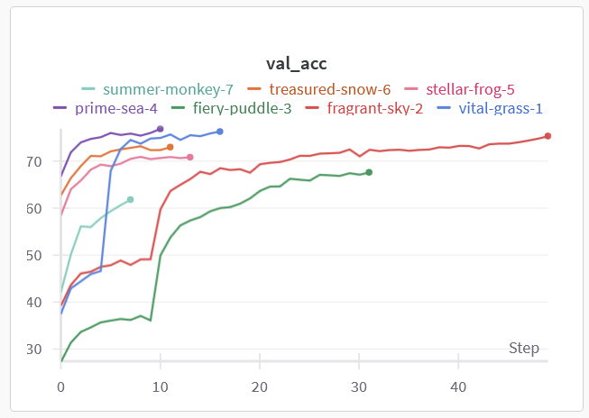

# Midterm Challenge Report - Zach Gentile

## AI Disclosure
<!-- 
Describe your AI assistance process here.
- Explain which tools you used (e.g., ChatGPT, Copilot, etc.).
- Enumerate the parts of the code you wrote yourself and those where you used AI assistance.
- Include detailed code comments within the codebase.
-->

I did not use generative AI to fill in the starter code, or define the initial structure of my models. I also implemented various augmentation techniques and similar changes to config myself. However, I did use generative AI tools to expand on the starter code, and improve my model architectures. I used Claude 3.7 Sonnet Thinking throughout the assignment. The first key use of Claude came to my early stopping implementation. I knew that early stopping was easily implementable in Keras but not in PyTorch. It generated the early stopping class for me and suggested ways to implement it. The next thing that Claude helped me with was my implementations of fine tuning. Claude suggested that I try three approaches to fine tuning. A gradual approach, a two step approach, and a full approach. The full approach wound up being my approach of choice but I kept the other approaches in my codebase. I initally implemented Resnet18 and Resnet34, but then Claude helped me rewrite my implementations of the two to be compatible with fine tuning. 

## CIFAR-100 Dataset
The CIFAR-100 dataset is a subset of the Tiny Images dataset. It consists of 60,000 images (50,000 train, 10,000 test). Each image is 32x32 and has RGB channels. The dataset has 100 classes, which are further grouped into 20 superclasses. Each image comes with a label for the class and superclass that it belongs to. Each class has 500 training images and 500 testing images. Each image should only have one prominent instance of the object that the class describes.
## Model Description
My first model is a simple CNN that performs quite poorly on the OOD data. The architecture consists of two convolutional blocks and then the classifier block. Inside the convolutional blocks, there are 2d convolutions that have a kernel_size of 3, and stride and padding of 1. The first convolutional block has 3 in channels and 32 out channels. The second convolutional block has 32 in channels and 64 out channels. Each convolutional layer is followed by batch normalization, ReLU activation, and 2d max pooling with a kernel size of two. The classifier block has a linear layer with an output size of 256, which is followed by a ReLU activation layer, and then finally a linear layer with an output size of 100, representing our classification predictions.

My second model is a more complex CNN that shows better performance on the validation and OOD dataset. The architecture consists of four convolutional blocks and then the classifier block. Inside the convolutional blocks, there are 2d convolutions that have a kernel_size of 3, and stride and padding of 1. The first convolutional block has 3 in channels and 64 out channels. The second convolutional block has 64 in channels and 128 out channels. The third convolutional block has 128 in channels and 256 out channels. The fourth convolutional block has 256 in channels and 512 out channels. Each of the 2d convolutional layers are followed by 2d batch normalization, ReLU activation, 2d maxpooling with a kernel size of 2, and dropout(.25). The classification block has a linear layer with an input size of 512 * 2 * 2 (output of the last convolutional block), and an output size of 1024. That linear layer is followed by ReLU activation and dropout(.25). Then, there is another linear layer with an input size of 1024 and output size of 512. That is followed by ReLU activation and dropout(.5). After the dropout(.5) is the classification linear layer with an input size of 512 and an output size of 100.

My final model is a fine tuned Resnet34 architecture. First, our CIFAR-100 input images are rescaled to 224x224, as that is the size of the images that Resnet34 was trained on. Then, the model is loaded using torchvision.models, with pretrained set to true. ResNet34 begins with an initial 7×7 convolutional layer with 64 filters and stride 2, followed by batch normalization, ReLU activation, and a 3×3 max pooling layer with stride 2. The backbone consists of four sequential layer groups containing 3, 4, 6, and 3 residual blocks respectively, with each group processing increasingly abstract features. These groups progressively expand the channel dimensions (64→128→256→512) while reducing spatial dimensions through stride-2 convolutions at the beginning of each group (except the first). Each residual block contains two 3×3 convolutional layers with batch normalization and ReLU activations, wrapped in a skip connection that adds the input directly to the block's output. This structure forces the network to learn residual mappings rather than complete transformations, making optimization significantly easier for deeper architectures. 

## Hyperparameter Tuning

My models were subject to various hyperparameters. The first two models were tuned by the batch size, learning rate, weight decay, and label smoothing. The models were particulary sensitive to the learning rate and weight decay hyperparameters. I found that the best learning rate for these two models was around .001. I chose to use a CosineAnnealing LR scheduler, after experiments showed it leads to more stable learning. Interestingly, a high learning rate, weight decay, or label smoothing hyperparameter lead to a strange situation where the model was always stuck as 1% accuracy and would guess the same class for everything. Lowering the learning rate and weight decay values alleviated this issue. I found that using a weight decay value that is around .0001 produced appropriate results without stunting learning. The final label smoothing value that I chose is .1. Values higher than that such as .2 lead to decreased performance. 

## Regularization Techniques
<!-- 
Explain the regularization methods used.
Discuss their impact on the model performance.
-->

The first regularization technique that I used is dropout. Dropout was tricky for me to get right. At first, I was using dropout too aggressively, having multiple .5 dropout layers, which lead to poor performance and overregularization. However, after that, I removed too much dropout, and my training accuracy soared. At first I was encouraged by this, but then it became obvious that my model was simply overfitting. Once I found an appropriate configuration of dropout, I was able to prevent overfitting and extremely high training accuracies, while improving on validation and OOD accuracy. 

The second regularization technique that I used is weight decay (through the AdamW optimizer). From my trials, I found that the best weight decay seemed to be 10% of the original starting learning rate. While its impact did not seem to be as large as dropout's impact, it did seem to close the gap between training and validation accuracy, indicating less overfitting. I found that it is important to not set weight decay to be too high, as that lead to minimal learning and terrible performance.

The third regularization technique that I used is early stopping. Early stopping will stop the training process once validation loss plateaus. It will prevent the model from continuing to train and overfit to the training data while there are no improvements to validation loss. This also is a good technique to save time, as it will eliminate all epochs that are not necessary and will keep track of the best model along the way. I used patience = 5, which means that if the validation loss does not improve for 5 straight epochs, training will stop early. This primarly lead to a decrease in overfitting and in general saved me some time that I otherwise would have wasted on useless training epochs where there is no learning.

## Data Augmentation Strategy

I used various Data Augmentation Strategies with varying success.

My most consistently successful Data Augmentation Strategies were RandomRotation(degrees=15) and RandomHorizontalFlip(p=.5). RandomRotation(degrees=15) took every training image and rotated it within +- 15 degrees. RandomHorizontalFlip(p=.5) took approximately half of the training images and flipped them horizontally. Based on my experiments, it seemed that these two alone lead to the most improvement in performance, and adding any other augmentation lead to minimal improvement or even made results worse. I experimented with a lower probability for RandomHorizontalFlip but found no significantly better parameter than .5. These two augmentation techniques were what I used to achieve my best performance in my Part1 (SimpleCNN) and Part2 (AdvancedCNN).

I also experimented with multiple other augmentation techniques. Namely, I used ColorJitter(brightness=0.2, contrast=0.2, saturation=0.2, hue=0.1) and RandomAffine(degrees=10, translate=(0.1, 0.1), scale=(0.9, 1.1)). ColorJitter(brightness=0.2, contrast=0.2, saturation=0.2, hue=0.1) slightly alters the brightness, contrast, saturation, and hue values for each training image to prevent overfitting on any of these features. RandomAffine(degrees=10, translate=(0.1, 0.1), scale=(0.9, 1.1)) will provide an additional small rotation to each image, as well as slightly translating the image and scaling the image. This is meant to prevent overfitting on the location of pixels. These two augmentation techniques showed no improvement or even made results worse for my first two models. However, for my fine tuning transfer learning approach, they produced minimal improvements in performance on the OOD dataset, about a 2% improvement.

I also changed the normalization of the image tensors to match that of the OOD dataset, which had minimal impact.

## Results Analysis
<!-- 
Analyze the results of your model.
Discuss the strengths, weaknesses, and potential areas for improvement.
-->

My most successful model was my fine-tuned Resnet-34 architecture using full fine tuning. This means that I fine tuned the whole model, but used an lr scheduler to prevent overfitting. While the results of my other two fine tuning methods (two step and gradual) were comparable, the full fine-tuning method trained much faster, reaching convergence in just 11 epochs. It achieved my highest leaderboard score of .56181, compared to .53 using the same strategies with Resnet18. It achieved a training accuracy of 97% and a validation accuracy of 76.87%, which is the best out of any run with any configuration that I've had. While this model did show strong performance, I think it could partially be attributed to overfitting, although I did put regularization metrics in place to limit overfitting. While quick training and convergence seemed nice, perhaps my model converged too quickly and more "patient" learning would perform better on OOD data. I did test this theory, and while my few trials showed no differences, this is something that could be tested on a larger scale. I had a similar model that trained for 50 epochs and had a 5 epoch "warming up" phase, but it was no better than my model that had no warming up phase and trained for only 11 epochs. It was clear, however, that any amount of fine tuning is beneficial, as I tried Resnet without fine tuning and achieved only 41% accuracy on the OOD data. One potential area for improvement would be for me to use the Resnet50 model, which uses a more complex archiecture including bottleneck blocks. However, it overwhelmed my gpu so I chose to not use it for that reason. It does highlight the strength that my Resnet34 full fine-tuned model was able to achieve impressive results on one of the shortest training times. 

## Experiment Tracking Summary

Experiment tracking summary for final fine-tuning model: 

The top purple line represents my best model. It used full fine-tuning and achieved the best training, validation, and OOD accuracy. Interestingly, using a warm up phase (as seen in the lines that start low and then shoot up after 5-10 iterations) did not provide any improvements to performance, and took much longer to train. 

Results for Resnet with no fine-tuning:

The model performed well on the training set, but there was severe overfitting. The validation accuracy was around 40% less than the training accuracy and the OOD accuracy was 10% less than the validation accuracy.

Training with LR scheduler vs without LR scheduler: 

Clearly, the training with the LR scheduler leads to more smooth training.

Weird phenomenom with too high of a LR:

The validation accuracy would stay at around 1% and would guess the same class for everything. This happened in several different models.

Final results:

No transfer learning (~40 successful trials):

Transfer learning with fine-tuning (~7 experiments):

Best submission performance for each part:

My fine-tuned transfer learning model achieved .56181 accuracy. My best non transfer learning model achieved .37749 accuracy. My best simple model achieved .27565 accuracy.